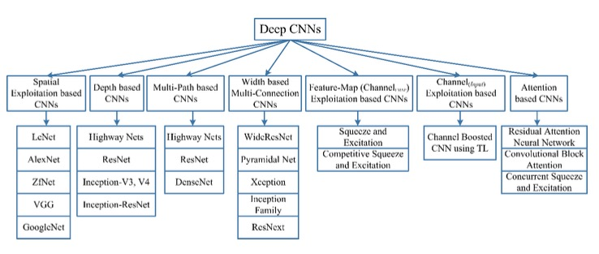
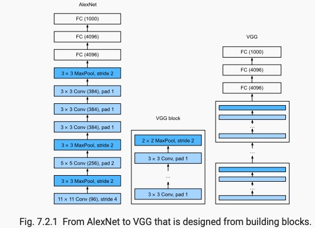
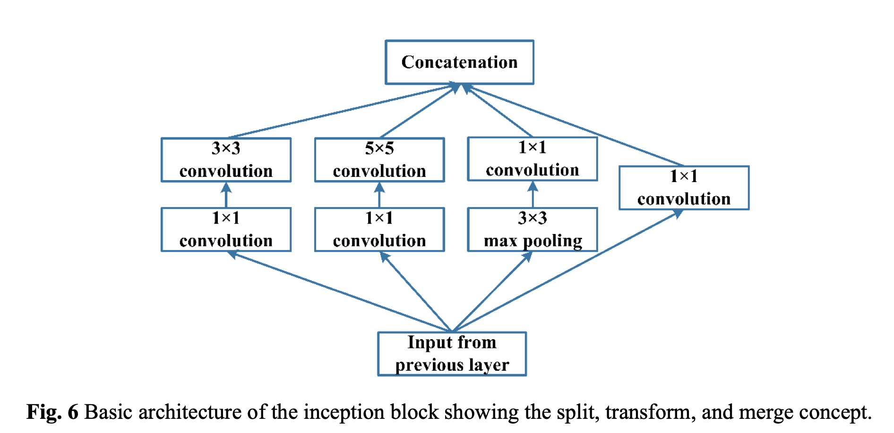
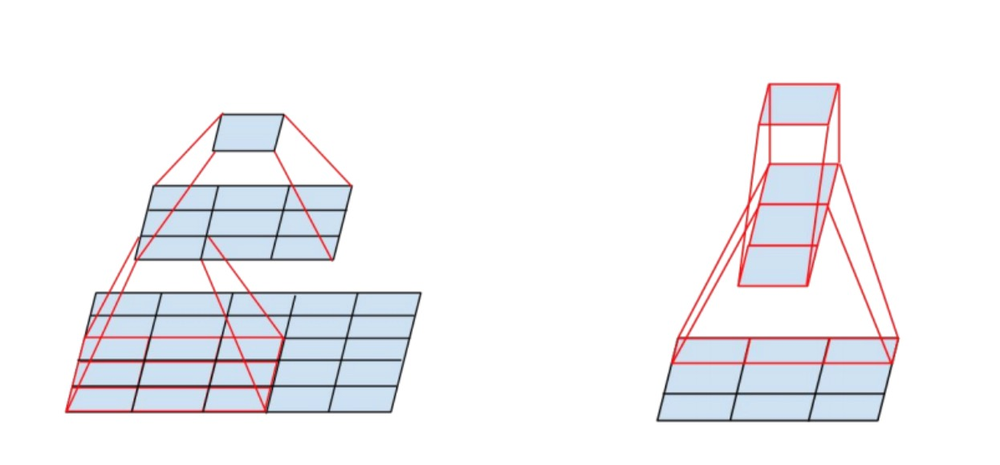
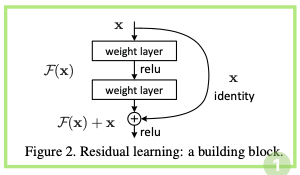
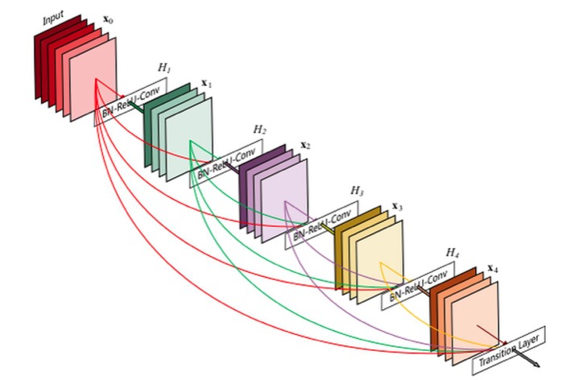
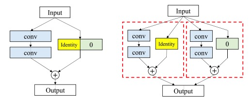
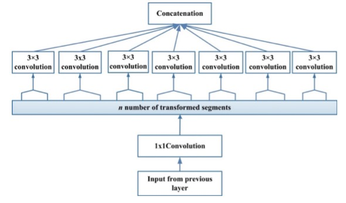
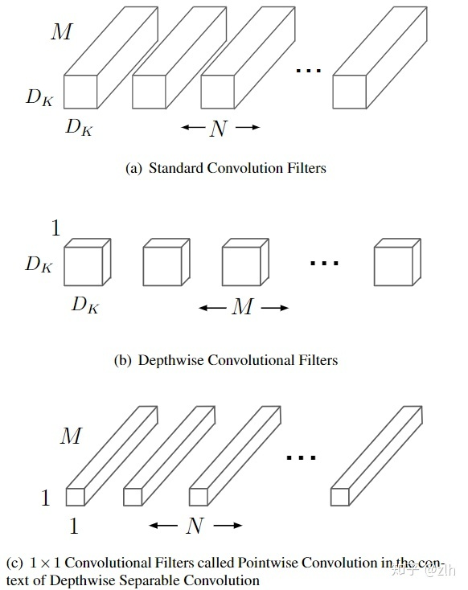

# 分类网络 阅读笔记
---

$上图将主要算法分为了Spatial Exploitation based CNNs, Depth based CNNs, Muilti_Path based CNNs, Width based Muilti-Connection CNNs, Feature Map (Channel_{FMap}) Exploitation based CNNs, Attention based CNNs7个类别. 各模型的主要贡献,参数,优先级见下表.$
<!-- LeNet | AlexNet | ZfNet | VGG | GoogleNet | Hightway Nets | ResNet | Inception-V3, V4 | Inception-ResNet | DenseNet | Pyramidal Net | Xcception | Sequeeze and Excitation | Competitive Squeeze and Exicitation | Residual Attention Neural Network | Convolutional Block Attention | Concurrent Squeeze and Excitation
:-: | :-: | :-: | :-: | :-: | :-: | :-: | :-: | :-: | :-: | :-: | :-: | :-: | :-: | :-: | :-: | :-:
aaa | bbb | ccc | ddd | eee | aaa | bbb | ccc | ddd | eee | aaa | bbb | ccc | ddd | eee | ddd | eee 
18  | 18  | 18  | 18  | 18  | 18  | 18  | 18  | 18  | 18  | 18  | 18  | 18  | 18  | 18  | 18  | 18   -->

<body>
<table cellspacing="0" border="0">
	<colgroup span="2" width="138"></colgroup>
	<colgroup width="216"></colgroup>
	<colgroup span="5" width="138"></colgroup>
	<tr>
		<td colspan=8 height="37" align="center" valign=middle><font size=3>Rank</font></td>
		</tr>
	<tr>
		<td style="border-top: 1px solid #ffffff; border-bottom: 1px solid #ffffff; border-left: 1px solid #ffffff; border-right: 1px solid #ffffff" height="42" align="center" valign=middle sdnum="1033;0;@"><b><font face="Times New Roman" size=4>Architecture Name</font></b></td>
		<td style="border-top: 1px solid #ffffff; border-bottom: 1px solid #ffffff; border-left: 1px solid #ffffff; border-right: 1px solid #ffffff" align="center" valign=middle sdnum="1033;0;@"><b><font face="Times New Roman" size=4>Year</font></b></td>
		<td style="border-top: 1px solid #ffffff; border-bottom: 1px solid #ffffff; border-left: 1px solid #ffffff; border-right: 1px solid #ffffff" align="center" valign=middle sdnum="1033;0;@"><b><font face="Times New Roman" size=4>Main contribution</font></b></td>
		<td style="border-top: 1px solid #ffffff; border-bottom: 1px solid #ffffff; border-left: 1px solid #ffffff; border-right: 1px solid #ffffff" align="center" valign=middle sdnum="1033;0;@"><b><font face="Times New Roman" size=4>Parameters</font></b></td>
		<td style="border-top: 1px solid #ffffff; border-bottom: 1px solid #ffffff; border-left: 1px solid #ffffff; border-right: 1px solid #ffffff" align="center" valign=middle sdnum="1033;0;@"><b><font face="Times New Roman" size=4>Error Rate</font></b></td>
		<td style="border-top: 1px solid #ffffff; border-bottom: 1px solid #ffffff; border-left: 1px solid #ffffff; border-right: 1px solid #ffffff" align="center" valign=middle sdnum="1033;0;@"><b><font face="Times New Roman" size=4>Depth</font></b></td>
		<td style="border-top: 1px solid #ffffff; border-bottom: 1px solid #ffffff; border-left: 1px solid #ffffff; border-right: 1px solid #ffffff" align="center" valign=middle sdnum="1033;0;@"><b><font face="Times New Roman" size=4>Category</font></b></td>
		<td style="border-top: 1px solid #ffffff; border-bottom: 1px solid #ffffff; border-left: 1px solid #ffffff; border-right: 1px solid #ffffff" align="center" valign=middle sdnum="1033;0;@"><b><font face="Times New Roman" size=4>Reference</font></b></td>
	</tr>
	<tr>
		<td style="border-top: 1px solid #ffffff; border-bottom: 1px solid #ffffff; border-left: 1px solid #ffffff; border-right: 1px solid #ffffff" height="64" align="center" valign=middle sdnum="1033;0;@"><b><font face="Times New Roman" size=4>LeNet</font></b></td>
		<td style="border-top: 1px solid #ffffff; border-bottom: 1px solid #ffffff; border-left: 1px solid #ffffff; border-right: 1px solid #ffffff" align="center" valign=middle sdnum="1033;0;@"><font face="Times New Roman" size=4>1998</font></td>
		<td style="border-top: 1px solid #ffffff; border-bottom: 1px solid #ffffff; border-left: 1px solid #ffffff; border-right: 1px solid #ffffff" align="center" valign=middle sdnum="1033;0;@"><font face="Times New Roman" size=4>First popular CNN architecture</font></td>
		<td style="border-top: 1px solid #ffffff; border-bottom: 1px solid #ffffff; border-left: 1px solid #ffffff; border-right: 1px solid #ffffff" align="center" valign=middle sdnum="1033;0;@"><font face="Times New Roman" size=4>0.060 M</font></td>
		<td style="border-top: 1px solid #ffffff; border-bottom: 1px solid #ffffff; border-left: 1px solid #ffffff; border-right: 1px solid #ffffff" align="center" valign=middle sdnum="1033;0;@"><font face="Times New Roman" size=4>[dist]MNIST: 0.8<br>MNIST: 0.95</font></td>
		<td style="border-top: 1px solid #ffffff; border-bottom: 1px solid #ffffff; border-left: 1px solid #ffffff; border-right: 1px solid #ffffff" align="center" valign=middle sdnum="1033;0;@"><font face="Times New Roman" size=4>5</font></td>
		<td style="border-top: 1px solid #ffffff; border-bottom: 1px solid #ffffff; border-left: 1px solid #ffffff; border-right: 1px solid #ffffff" align="center" valign=middle sdnum="1033;0;@"><font face="Times New Roman" size=4>Spatial Exploitation</font></td>
		<td style="border-top: 1px solid #ffffff; border-bottom: 1px solid #ffffff; border-left: 1px solid #ffffff; border-right: 1px solid #ffffff" align="center" valign=middle sdnum="1033;0;@"><font face="Times New Roman" size=4>class 2</font></td>
	</tr>
	<tr>
		<td style="border-top: 1px solid #ffffff; border-bottom: 1px solid #ffffff; border-left: 1px solid #ffffff; border-right: 1px solid #ffffff" height="85" align="center" valign=middle sdnum="1033;0;@"><b><font face="Times New Roman" size=4>AlexNet</font></b></td>
		<td style="border-top: 1px solid #ffffff; border-bottom: 1px solid #ffffff; border-left: 1px solid #ffffff; border-right: 1px solid #ffffff" align="center" valign=middle sdnum="1033;0;@"><font face="Times New Roman" size=4>2012</font></td>
		<td style="border-top: 1px solid #ffffff; border-bottom: 1px solid #ffffff; border-left: 1px solid #ffffff; border-right: 1px solid #ffffff" align="center" valign=middle sdnum="1033;0;@"><font face="Times New Roman" size=4>1. Deeper and wider than the LeNet&#8232;2. Uses Relu, dropout and overlap Pooling A4</font></td>
		<td style="border-top: 1px solid #ffffff; border-bottom: 1px solid #ffffff; border-left: 1px solid #ffffff; border-right: 1px solid #ffffff" align="center" valign=middle sdnum="1033;0;@"><font face="Times New Roman" size=4>60 M</font></td>
		<td style="border-top: 1px solid #ffffff; border-bottom: 1px solid #ffffff; border-left: 1px solid #ffffff; border-right: 1px solid #ffffff" align="center" valign=middle sdnum="1033;0;@"><font face="Times New Roman" size=4>ImageNet: 16.4</font></td>
		<td style="border-top: 1px solid #ffffff; border-bottom: 1px solid #ffffff; border-left: 1px solid #ffffff; border-right: 1px solid #ffffff" align="center" valign=middle sdnum="1033;0;@"><font face="Times New Roman" size=4>8</font></td>
		<td style="border-top: 1px solid #ffffff; border-bottom: 1px solid #ffffff; border-left: 1px solid #ffffff; border-right: 1px solid #ffffff" align="center" valign=middle sdnum="1033;0;@"><font face="Times New Roman" size=4>Spatial Exploitation</font></td>
		<td style="border-top: 1px solid #ffffff; border-bottom: 1px solid #ffffff; border-left: 1px solid #ffffff; border-right: 1px solid #ffffff" align="center" valign=middle sdnum="1033;0;@"><font face="Times New Roman" size=4>class 1</font></td>
	</tr>
	<tr>
		<td style="border-top: 1px solid #ffffff; border-bottom: 1px solid #ffffff; border-left: 1px solid #ffffff; border-right: 1px solid #ffffff" height="42" align="center" valign=middle sdnum="1033;0;@"><b><font face="Times New Roman" size=4>ZfNet</font></b></td>
		<td style="border-top: 1px solid #ffffff; border-bottom: 1px solid #ffffff; border-left: 1px solid #ffffff; border-right: 1px solid #ffffff" align="center" valign=middle sdnum="1033;0;@"><font face="Times New Roman" size=4>2014</font></td>
		<td style="border-top: 1px solid #ffffff; border-bottom: 1px solid #ffffff; border-left: 1px solid #ffffff; border-right: 1px solid #ffffff" align="center" valign=middle sdnum="1033;0;@"><font face="Times New Roman" size=4>Visualization of intermediate layers</font></td>
		<td style="border-top: 1px solid #ffffff; border-bottom: 1px solid #ffffff; border-left: 1px solid #ffffff; border-right: 1px solid #ffffff" align="center" valign=middle sdnum="1033;0;@"><font face="Times New Roman" size=4>60 M</font></td>
		<td style="border-top: 1px solid #ffffff; border-bottom: 1px solid #ffffff; border-left: 1px solid #ffffff; border-right: 1px solid #ffffff" align="center" valign=middle sdnum="1033;0;@"><font face="Times New Roman" size=4>ImageNet: 11.7</font></td>
		<td style="border-top: 1px solid #ffffff; border-bottom: 1px solid #ffffff; border-left: 1px solid #ffffff; border-right: 1px solid #ffffff" align="center" valign=middle sdnum="1033;0;@"><font face="Times New Roman" size=4>8</font></td>
		<td style="border-top: 1px solid #ffffff; border-bottom: 1px solid #ffffff; border-left: 1px solid #ffffff; border-right: 1px solid #ffffff" align="center" valign=middle sdnum="1033;0;@"><font face="Times New Roman" size=4>Spatial Exploitation</font></td>
		<td style="border-top: 1px solid #ffffff; border-bottom: 1px solid #ffffff; border-left: 1px solid #ffffff; border-right: 1px solid #ffffff" align="center" valign=middle sdnum="1033;0;@"><font face="Times New Roman" size=4>class 3</font></td>
	</tr>
	<tr>
		<td style="border-top: 1px solid #ffffff; border-bottom: 1px solid #ffffff; border-left: 1px solid #ffffff; border-right: 1px solid #ffffff" height="58" align="center" valign=middle sdnum="1033;0;@"><b><font face="Times New Roman" size=4>VGG</font></b></td>
		<td style="border-top: 1px solid #ffffff; border-bottom: 1px solid #ffffff; border-left: 1px solid #ffffff; border-right: 1px solid #ffffff" align="center" valign=middle sdnum="1033;0;@"><font face="Times New Roman" size=4>2014</font></td>
		<td style="border-top: 1px solid #ffffff; border-bottom: 1px solid #ffffff; border-left: 1px solid #ffffff; border-right: 1px solid #ffffff" align="center" valign=middle sdnum="1033;0;@"><font face="Times New Roman" size=4>Homogenous topology<br>Uses small size kernels</font></td>
		<td style="border-top: 1px solid #ffffff; border-bottom: 1px solid #ffffff; border-left: 1px solid #ffffff; border-right: 1px solid #ffffff" align="center" valign=middle sdnum="1033;0;@"><font face="Times New Roman" size=4>138 M</font></td>
		<td style="border-top: 1px solid #ffffff; border-bottom: 1px solid #ffffff; border-left: 1px solid #ffffff; border-right: 1px solid #ffffff" align="center" valign=middle sdnum="1033;0;@"><font face="Times New Roman" size=4>ImageNet: 7.3</font></td>
		<td style="border-top: 1px solid #ffffff; border-bottom: 1px solid #ffffff; border-left: 1px solid #ffffff; border-right: 1px solid #ffffff" align="center" valign=middle sdnum="1033;0;@"><font face="Times New Roman" size=4>19</font></td>
		<td style="border-top: 1px solid #ffffff; border-bottom: 1px solid #ffffff; border-left: 1px solid #ffffff; border-right: 1px solid #ffffff" align="center" valign=middle sdnum="1033;0;@"><font face="Times New Roman" size=4>Spatial Exploitation</font></td>
		<td style="border-top: 1px solid #ffffff; border-bottom: 1px solid #ffffff; border-left: 1px solid #ffffff; border-right: 1px solid #ffffff" align="center" valign=middle sdnum="1033;0;@"><font face="Times New Roman" size=4>class 1</font></td>
	</tr>
	<tr>
		<td style="border-top: 1px solid #ffffff; border-bottom: 1px solid #ffffff; border-left: 1px solid #ffffff; border-right: 1px solid #ffffff" height="64" align="center" valign=middle sdnum="1033;0;@"><b><font face="Times New Roman" size=4>GoogLeNet</font></b></td>
		<td style="border-top: 1px solid #ffffff; border-bottom: 1px solid #ffffff; border-left: 1px solid #ffffff; border-right: 1px solid #ffffff" align="center" valign=middle sdnum="1033;0;@"><font face="Times New Roman" size=4>2015</font></td>
		<td style="border-top: 1px solid #ffffff; border-bottom: 1px solid #ffffff; border-left: 1px solid #ffffff; border-right: 1px solid #ffffff" align="center" valign=middle sdnum="1033;0;@"><font face="Times New Roman" size=4>Introduced block concept<br>Split transform and merge idea</font></td>
		<td style="border-top: 1px solid #ffffff; border-bottom: 1px solid #ffffff; border-left: 1px solid #ffffff; border-right: 1px solid #ffffff" align="center" valign=middle sdnum="1033;0;@"><font face="Times New Roman" size=4>4 M</font></td>
		<td style="border-top: 1px solid #ffffff; border-bottom: 1px solid #ffffff; border-left: 1px solid #ffffff; border-right: 1px solid #ffffff" align="center" valign=middle sdnum="1033;0;@"><font face="Times New Roman" size=4>ImageNet: 6.7</font></td>
		<td style="border-top: 1px solid #ffffff; border-bottom: 1px solid #ffffff; border-left: 1px solid #ffffff; border-right: 1px solid #ffffff" align="center" valign=middle sdnum="1033;0;@"><font face="Times New Roman" size=4>22</font></td>
		<td style="border-top: 1px solid #ffffff; border-bottom: 1px solid #ffffff; border-left: 1px solid #ffffff; border-right: 1px solid #ffffff" align="center" valign=middle sdnum="1033;0;@"><font face="Times New Roman" size=4>Spatial Exploitation</font></td>
		<td style="border-top: 1px solid #ffffff; border-bottom: 1px solid #ffffff; border-left: 1px solid #ffffff; border-right: 1px solid #ffffff" align="center" valign=middle sdnum="1033;0;@"><font face="Times New Roman" size=4>class 1</font></td>
	</tr>
	<tr>
		<td style="border-top: 1px solid #ffffff; border-bottom: 1px solid #ffffff; border-left: 1px solid #ffffff; border-right: 1px solid #ffffff" height="106" align="center" valign=middle sdnum="1033;0;@"><b><font face="Times New Roman" size=4>Inception-V3</font></b></td>
		<td style="border-top: 1px solid #ffffff; border-bottom: 1px solid #ffffff; border-left: 1px solid #ffffff; border-right: 1px solid #ffffff" align="center" valign=middle sdnum="1033;0;@"><font face="Times New Roman" size=4>2015</font></td>
		<td style="border-top: 1px solid #ffffff; border-bottom: 1px solid #ffffff; border-left: 1px solid #ffffff; border-right: 1px solid #ffffff" align="center" valign=middle sdnum="1033;0;@"><font face="Times New Roman" size=4>Handles the problem of a representational bottleneck<br>Replace large size filters with small filters</font></td>
		<td style="border-top: 1px solid #ffffff; border-bottom: 1px solid #ffffff; border-left: 1px solid #ffffff; border-right: 1px solid #ffffff" align="center" valign=middle sdnum="1033;0;@"><font face="Times New Roman" size=4>23.6 M</font></td>
		<td style="border-top: 1px solid #ffffff; border-bottom: 1px solid #ffffff; border-left: 1px solid #ffffff; border-right: 1px solid #ffffff" align="center" valign=middle sdnum="1033;0;@"><font face="Times New Roman" size=4>ImageNet: 3.5</font></td>
		<td style="border-top: 1px solid #ffffff; border-bottom: 1px solid #ffffff; border-left: 1px solid #ffffff; border-right: 1px solid #ffffff" align="center" valign=middle sdnum="1033;0;@"><font face="Times New Roman" size=4>159</font></td>
		<td style="border-top: 1px solid #ffffff; border-bottom: 1px solid #ffffff; border-left: 1px solid #ffffff; border-right: 1px solid #ffffff" align="center" valign=middle sdnum="1033;0;@"><font face="Times New Roman" size=4>Depth + Width</font></td>
		<td style="border-top: 1px solid #ffffff; border-bottom: 1px solid #ffffff; border-left: 1px solid #ffffff; border-right: 1px solid #ffffff" align="center" valign=middle sdnum="1033;0;@"><font face="Times New Roman" size=4>class 1</font></td>
	</tr>
	<tr>
		<td style="border-top: 1px solid #ffffff; border-bottom: 1px solid #ffffff; border-left: 1px solid #ffffff; border-right: 1px solid #ffffff" height="42" align="center" valign=middle sdnum="1033;0;@"><b><font face="Times New Roman" size=4>Highway Networks</font></b></td>
		<td style="border-top: 1px solid #ffffff; border-bottom: 1px solid #ffffff; border-left: 1px solid #ffffff; border-right: 1px solid #ffffff" align="center" valign=middle sdnum="1033;0;@"><font face="Times New Roman" size=4>2015</font></td>
		<td style="border-top: 1px solid #ffffff; border-bottom: 1px solid #ffffff; border-left: 1px solid #ffffff; border-right: 1px solid #ffffff" align="center" valign=middle sdnum="1033;0;@"><font face="Times New Roman" size=4>Introduced an idea of Multi-path</font></td>
		<td style="border-top: 1px solid #ffffff; border-bottom: 1px solid #ffffff; border-left: 1px solid #ffffff; border-right: 1px solid #ffffff" align="center" valign=middle sdnum="1033;0;@"><font face="Times New Roman" size=4>2.3 M</font></td>
		<td style="border-top: 1px solid #ffffff; border-bottom: 1px solid #ffffff; border-left: 1px solid #ffffff; border-right: 1px solid #ffffff" align="center" valign=middle sdnum="1033;0;@"><font face="Times New Roman" size=4>CIFAR-10: 7.76</font></td>
		<td style="border-top: 1px solid #ffffff; border-bottom: 1px solid #ffffff; border-left: 1px solid #ffffff; border-right: 1px solid #ffffff" align="center" valign=middle sdnum="1033;0;@"><font face="Times New Roman" size=4>19</font></td>
		<td style="border-top: 1px solid #ffffff; border-bottom: 1px solid #ffffff; border-left: 1px solid #ffffff; border-right: 1px solid #ffffff" align="center" valign=middle sdnum="1033;0;@"><font face="Times New Roman" size=4>Depth + Multi-Path</font></td>
		<td style="border-top: 1px solid #ffffff; border-bottom: 1px solid #ffffff; border-left: 1px solid #ffffff; border-right: 1px solid #ffffff" align="center" valign=middle sdnum="1033;0;@"><font face="Times New Roman" size=4>class 2</font></td>
	</tr>
	<tr>
		<td style="border-top: 1px solid #ffffff; border-bottom: 1px solid #ffffff; border-left: 1px solid #ffffff; border-right: 1px solid #ffffff" height="64" align="center" valign=middle sdnum="1033;0;@"><b><font face="Times New Roman" size=4>Inception-V4</font></b></td>
		<td style="border-top: 1px solid #ffffff; border-bottom: 1px solid #ffffff; border-left: 1px solid #ffffff; border-right: 1px solid #ffffff" align="center" valign=middle sdnum="1033;0;@"><font face="Times New Roman" size=4>2016</font></td>
		<td style="border-top: 1px solid #ffffff; border-bottom: 1px solid #ffffff; border-left: 1px solid #ffffff; border-right: 1px solid #ffffff" align="center" valign=middle sdnum="1033;0;@"><font face="Times New Roman" size=4>Split transform and merge idea Uses asymmetric filters</font></td>
		<td style="border-top: 1px solid #ffffff; border-bottom: 1px solid #ffffff; border-left: 1px solid #ffffff; border-right: 1px solid #ffffff" align="center" valign=middle sdnum="1033;0;@"><font face="Times New Roman" size=4>35 M</font></td>
		<td style="border-top: 1px solid #ffffff; border-bottom: 1px solid #ffffff; border-left: 1px solid #ffffff; border-right: 1px solid #ffffff" align="center" valign=middle sdnum="1033;0;@"><font face="Times New Roman" size=4>ImageNet: 4.01</font></td>
		<td style="border-top: 1px solid #ffffff; border-bottom: 1px solid #ffffff; border-left: 1px solid #ffffff; border-right: 1px solid #ffffff" align="center" valign=middle sdnum="1033;0;@"><font face="Times New Roman" size=4>70</font></td>
		<td style="border-top: 1px solid #ffffff; border-bottom: 1px solid #ffffff; border-left: 1px solid #ffffff; border-right: 1px solid #ffffff" align="center" valign=middle sdnum="1033;0;@"><font face="Times New Roman" size=4>Depth +Width</font></td>
		<td style="border-top: 1px solid #ffffff; border-bottom: 1px solid #ffffff; border-left: 1px solid #ffffff; border-right: 1px solid #ffffff" align="center" valign=middle sdnum="1033;0;@"><font face="Times New Roman" size=4>class 2</font></td>
	</tr>
	<tr>
		<td style="border-top: 1px solid #ffffff; border-bottom: 1px solid #ffffff; border-left: 1px solid #ffffff; border-right: 1px solid #ffffff" height="64" align="center" valign=middle sdnum="1033;0;@"><b><font face="Times New Roman" size=4>Inception-ResNet</font></b></td>
		<td style="border-top: 1px solid #ffffff; border-bottom: 1px solid #ffffff; border-left: 1px solid #ffffff; border-right: 1px solid #ffffff" align="center" valign=middle sdnum="1033;0;@"><font face="Times New Roman" size=4>2016</font></td>
		<td style="border-top: 1px solid #ffffff; border-bottom: 1px solid #ffffff; border-left: 1px solid #ffffff; border-right: 1px solid #ffffff" align="center" valign=middle sdnum="1033;0;@"><font face="Times New Roman" size=4>Uses split transform merge idea and residual links</font></td>
		<td style="border-top: 1px solid #ffffff; border-bottom: 1px solid #ffffff; border-left: 1px solid #ffffff; border-right: 1px solid #ffffff" align="center" valign=middle sdnum="1033;0;@"><font face="Times New Roman" size=4>55.8M</font></td>
		<td style="border-top: 1px solid #ffffff; border-bottom: 1px solid #ffffff; border-left: 1px solid #ffffff; border-right: 1px solid #ffffff" align="center" valign=middle sdnum="1033;0;@"><font face="Times New Roman" size=4>ImageNet: 3.52</font></td>
		<td style="border-top: 1px solid #ffffff; border-bottom: 1px solid #ffffff; border-left: 1px solid #ffffff; border-right: 1px solid #ffffff" align="center" valign=middle sdnum="1033;0;@"><font face="Times New Roman" size=4>572</font></td>
		<td style="border-top: 1px solid #ffffff; border-bottom: 1px solid #ffffff; border-left: 1px solid #ffffff; border-right: 1px solid #ffffff" align="center" valign=middle sdnum="1033;0;@"><font face="Times New Roman" size=4>Depth + Width +</font></td>
		<td style="border-top: 1px solid #ffffff; border-bottom: 1px solid #ffffff; border-left: 1px solid #ffffff; border-right: 1px solid #ffffff" align="center" valign=middle sdnum="1033;0;@"><font face="Times New Roman" size=4>class 2</font></td>
	</tr>
	<tr>
		<td style="border-top: 1px solid #ffffff; border-bottom: 1px solid #ffffff; border-left: 1px solid #ffffff; border-right: 1px solid #ffffff" height="64" align="center" valign=middle sdnum="1033;0;@"><b><font face="Times New Roman" size=4>ResNet</font></b></td>
		<td style="border-top: 1px solid #ffffff; border-bottom: 1px solid #ffffff; border-left: 1px solid #ffffff; border-right: 1px solid #ffffff" align="center" valign=middle sdnum="1033;0;@"><font face="Times New Roman" size=4>2016</font></td>
		<td style="border-top: 1px solid #ffffff; border-bottom: 1px solid #ffffff; border-left: 1px solid #ffffff; border-right: 1px solid #ffffff" align="center" valign=middle sdnum="1033;0;@"><font face="Times New Roman" size=4>Residual learning Identity mapping based skip connections</font></td>
		<td style="border-top: 1px solid #ffffff; border-bottom: 1px solid #ffffff; border-left: 1px solid #ffffff; border-right: 1px solid #ffffff" align="center" valign=middle sdnum="1033;0;@"><font face="Times New Roman" size=4>25.6 M</font></td>
		<td style="border-top: 1px solid #ffffff; border-bottom: 1px solid #ffffff; border-left: 1px solid #ffffff; border-right: 1px solid #ffffff" align="center" valign=middle sdnum="1033;0;@"><font face="Times New Roman" size=4>ImageNet: 3.6<br>CIFAR-10: 6.43</font></td>
		<td style="border-top: 1px solid #ffffff; border-bottom: 1px solid #ffffff; border-left: 1px solid #ffffff; border-right: 1px solid #ffffff" align="center" valign=middle sdnum="1033;0;@"><font face="Times New Roman" size=4>152</font></td>
		<td style="border-top: 1px solid #ffffff; border-bottom: 1px solid #ffffff; border-left: 1px solid #ffffff; border-right: 1px solid #ffffff" align="center" valign=middle sdnum="1033;0;@"><font face="Times New Roman" size=4>Depth + Multi-Path</font></td>
		<td style="border-top: 1px solid #ffffff; border-bottom: 1px solid #ffffff; border-left: 1px solid #ffffff; border-right: 1px solid #ffffff" align="center" valign=middle sdnum="1033;0;@"><font face="Times New Roman" size=4>class 1</font></td>
	</tr>
	<tr>
		<td style="border-top: 1px solid #ffffff; border-bottom: 1px solid #ffffff; border-left: 1px solid #ffffff; border-right: 1px solid #ffffff" height="85" align="center" valign=middle sdnum="1033;0;@"><b><font face="Times New Roman" size=4>DelugeNet</font></b></td>
		<td style="border-top: 1px solid #ffffff; border-bottom: 1px solid #ffffff; border-left: 1px solid #ffffff; border-right: 1px solid #ffffff" align="center" valign=middle sdnum="1033;0;@"><font face="Times New Roman" size=4>2016</font></td>
		<td style="border-top: 1px solid #ffffff; border-bottom: 1px solid #ffffff; border-left: 1px solid #ffffff; border-right: 1px solid #ffffff" align="center" valign=middle sdnum="1033;0;@"><font face="Times New Roman" size=4>Allows cross layer information flow in deep networks</font></td>
		<td style="border-top: 1px solid #ffffff; border-bottom: 1px solid #ffffff; border-left: 1px solid #ffffff; border-right: 1px solid #ffffff" align="center" valign=middle sdnum="1033;0;@"><font face="Times New Roman" size=4>20.2 M</font></td>
		<td style="border-top: 1px solid #ffffff; border-bottom: 1px solid #ffffff; border-left: 1px solid #ffffff; border-right: 1px solid #ffffff" align="center" valign=middle sdnum="1033;0;@"><font face="Times New Roman" size=4>CIFAR-10: 3.76<br>CIFAR-100: 19.02</font></td>
		<td style="border-top: 1px solid #ffffff; border-bottom: 1px solid #ffffff; border-left: 1px solid #ffffff; border-right: 1px solid #ffffff" align="center" valign=middle sdnum="1033;0;@"><font face="Times New Roman" size=4>146</font></td>
		<td style="border-top: 1px solid #ffffff; border-bottom: 1px solid #ffffff; border-left: 1px solid #ffffff; border-right: 1px solid #ffffff" align="center" valign=middle sdnum="1033;0;@"><font face="Times New Roman" size=4>Multi-path</font></td>
		<td style="border-top: 1px solid #ffffff; border-bottom: 1px solid #ffffff; border-left: 1px solid #ffffff; border-right: 1px solid #ffffff" align="center" valign=middle sdnum="1033;0;@"><font face="Times New Roman" size=4>class 2</font></td>
	</tr>
	<tr>
		<td style="border-top: 1px solid #ffffff; border-bottom: 1px solid #ffffff; border-left: 1px solid #ffffff; border-right: 1px solid #ffffff" height="85" align="center" valign=middle sdnum="1033;0;@"><b><font face="Times New Roman" size=4>FractalNet</font></b></td>
		<td style="border-top: 1px solid #ffffff; border-bottom: 1px solid #ffffff; border-left: 1px solid #ffffff; border-right: 1px solid #ffffff" align="center" valign=middle sdnum="1033;0;@"><font face="Times New Roman" size=4>2016</font></td>
		<td style="border-top: 1px solid #ffffff; border-bottom: 1px solid #ffffff; border-left: 1px solid #ffffff; border-right: 1px solid #ffffff" align="center" valign=middle sdnum="1033;0;@"><font face="Times New Roman" size=4>Different path lengths are interacting with each other without any residual connection</font></td>
		<td style="border-top: 1px solid #ffffff; border-bottom: 1px solid #ffffff; border-left: 1px solid #ffffff; border-right: 1px solid #ffffff" align="center" valign=middle sdnum="1033;0;@"><font face="Times New Roman" size=4>38.6 M</font></td>
		<td style="border-top: 1px solid #ffffff; border-bottom: 1px solid #ffffff; border-left: 1px solid #ffffff; border-right: 1px solid #ffffff" align="center" valign=middle sdnum="1033;0;@"><font face="Times New Roman" size=4>CIFAR-10: 7.27</font></td>
		<td style="border-top: 1px solid #ffffff; border-bottom: 1px solid #ffffff; border-left: 1px solid #ffffff; border-right: 1px solid #ffffff" align="center" valign=middle sdnum="1033;0;@"><font face="Times New Roman" size=4>20</font></td>
		<td style="border-top: 1px solid #ffffff; border-bottom: 1px solid #ffffff; border-left: 1px solid #ffffff; border-right: 1px solid #ffffff" align="center" valign=middle sdnum="1033;0;@"><font face="Times New Roman" size=4>Multi-Path</font></td>
		<td style="border-top: 1px solid #ffffff; border-bottom: 1px solid #ffffff; border-left: 1px solid #ffffff; border-right: 1px solid #ffffff" align="center" valign=middle sdnum="1033;0;@"><font face="Times New Roman" size=4>class 2</font></td>
	</tr>
	<tr>
		<td style="border-top: 1px solid #ffffff; border-bottom: 1px solid #ffffff; border-left: 1px solid #ffffff; border-right: 1px solid #ffffff" height="85" align="center" valign=middle sdnum="1033;0;@"><b><font face="Times New Roman" size=4>WideResNet</font></b></td>
		<td style="border-top: 1px solid #ffffff; border-bottom: 1px solid #ffffff; border-left: 1px solid #ffffff; border-right: 1px solid #ffffff" align="center" valign=middle sdnum="1033;0;@"><font face="Times New Roman" size=4>2016</font></td>
		<td style="border-top: 1px solid #ffffff; border-bottom: 1px solid #ffffff; border-left: 1px solid #ffffff; border-right: 1px solid #ffffff" align="center" valign=middle sdnum="1033;0;@"><font face="Times New Roman" size=4>Width is increased and depth is decreased</font></td>
		<td style="border-top: 1px solid #ffffff; border-bottom: 1px solid #ffffff; border-left: 1px solid #ffffff; border-right: 1px solid #ffffff" align="center" valign=middle sdnum="1033;0;@"><font face="Times New Roman" size=4>36.5 M</font></td>
		<td style="border-top: 1px solid #ffffff; border-bottom: 1px solid #ffffff; border-left: 1px solid #ffffff; border-right: 1px solid #ffffff" align="center" valign=middle sdnum="1033;0;@"><font face="Times New Roman" size=4>CIFAR-10: 3.89<br>CIFAR-100: 18.85</font></td>
		<td style="border-top: 1px solid #ffffff; border-bottom: 1px solid #ffffff; border-left: 1px solid #ffffff; border-right: 1px solid #ffffff" align="center" valign=middle sdnum="1033;0;@"><font face="Times New Roman" size=4>28</font></td>
		<td style="border-top: 1px solid #ffffff; border-bottom: 1px solid #ffffff; border-left: 1px solid #ffffff; border-right: 1px solid #ffffff" align="center" valign=middle sdnum="1033;0;@"><font face="Times New Roman" size=4>Width</font></td>
		<td style="border-top: 1px solid #ffffff; border-bottom: 1px solid #ffffff; border-left: 1px solid #ffffff; border-right: 1px solid #ffffff" align="center" valign=middle sdnum="1033;0;@"><font face="Times New Roman" size=4>class 2</font></td>
	</tr>
	<tr>
		<td style="border-top: 1px solid #ffffff; border-bottom: 1px solid #ffffff; border-left: 1px solid #ffffff; border-right: 1px solid #ffffff" height="64" align="center" valign=middle sdnum="1033;0;@"><b><font face="Times New Roman" size=4>Xception</font></b></td>
		<td style="border-top: 1px solid #ffffff; border-bottom: 1px solid #ffffff; border-left: 1px solid #ffffff; border-right: 1px solid #ffffff" align="center" valign=middle sdnum="1033;0;@"><font face="Times New Roman" size=4>2017</font></td>
		<td style="border-top: 1px solid #ffffff; border-bottom: 1px solid #ffffff; border-left: 1px solid #ffffff; border-right: 1px solid #ffffff" align="center" valign=middle sdnum="1033;0;@"><font face="Times New Roman" size=4>Depth wise convolution followed by point wise convolution</font></td>
		<td style="border-top: 1px solid #ffffff; border-bottom: 1px solid #ffffff; border-left: 1px solid #ffffff; border-right: 1px solid #ffffff" align="center" valign=middle sdnum="1033;0;@"><font face="Times New Roman" size=4>22.8 M</font></td>
		<td style="border-top: 1px solid #ffffff; border-bottom: 1px solid #ffffff; border-left: 1px solid #ffffff; border-right: 1px solid #ffffff" align="center" valign=middle sdnum="1033;0;@"><font face="Times New Roman" size=4>ImageNet: 0.055</font></td>
		<td style="border-top: 1px solid #ffffff; border-bottom: 1px solid #ffffff; border-left: 1px solid #ffffff; border-right: 1px solid #ffffff" align="center" valign=middle sdnum="1033;0;@"><font face="Times New Roman" size=4>126</font></td>
		<td style="border-top: 1px solid #ffffff; border-bottom: 1px solid #ffffff; border-left: 1px solid #ffffff; border-right: 1px solid #ffffff" align="center" valign=middle sdnum="1033;0;@"><font face="Times New Roman" size=4>Width</font></td>
		<td style="border-top: 1px solid #ffffff; border-bottom: 1px solid #ffffff; border-left: 1px solid #ffffff; border-right: 1px solid #ffffff" align="center" valign=middle sdnum="1033;0;@"><font face="Times New Roman" size=4>class 1</font></td>
	</tr>
	<tr>
		<td style="border-top: 1px solid #ffffff; border-bottom: 1px solid #ffffff; border-left: 1px solid #ffffff; border-right: 1px solid #ffffff" height="64" align="center" valign=middle sdnum="1033;0;@"><b><font face="Times New Roman" size=4>Residual Attention Network</font></b></td>
		<td style="border-top: 1px solid #ffffff; border-bottom: 1px solid #ffffff; border-left: 1px solid #ffffff; border-right: 1px solid #ffffff" align="center" valign=middle sdnum="1033;0;@"><font face="Times New Roman" size=4>2017</font></td>
		<td style="border-top: 1px solid #ffffff; border-bottom: 1px solid #ffffff; border-left: 1px solid #ffffff; border-right: 1px solid #ffffff" align="center" valign=middle sdnum="1033;0;@"><font face="Times New Roman" size=4>Introduced an attention mechanism</font></td>
		<td style="border-top: 1px solid #ffffff; border-bottom: 1px solid #ffffff; border-left: 1px solid #ffffff; border-right: 1px solid #ffffff" align="center" valign=middle sdnum="1033;0;@"><font face="Times New Roman" size=4>8.6 M</font></td>
		<td style="border-top: 1px solid #ffffff; border-bottom: 1px solid #ffffff; border-left: 1px solid #ffffff; border-right: 1px solid #ffffff" align="center" valign=middle sdnum="1033;0;@"><font face="Times New Roman" size=4>CIFAR-10: 3.90<br>ImageNet: 4.8</font></td>
		<td style="border-top: 1px solid #ffffff; border-bottom: 1px solid #ffffff; border-left: 1px solid #ffffff; border-right: 1px solid #ffffff" align="center" valign=middle sdnum="1033;0;@"><font face="Times New Roman" size=4>452</font></td>
		<td style="border-top: 1px solid #ffffff; border-bottom: 1px solid #ffffff; border-left: 1px solid #ffffff; border-right: 1px solid #ffffff" align="center" valign=middle sdnum="1033;0;@"><font face="Times New Roman" size=4>Attention</font></td>
		<td style="border-top: 1px solid #ffffff; border-bottom: 1px solid #ffffff; border-left: 1px solid #ffffff; border-right: 1px solid #ffffff" align="center" valign=middle sdnum="1033;0;@"><font face="Times New Roman" size=4>class 1</font></td>
	</tr>
	<tr>
		<td style="border-top: 1px solid #ffffff; border-bottom: 1px solid #ffffff; border-left: 1px solid #ffffff; border-right: 1px solid #ffffff" height="106" align="center" valign=middle sdnum="1033;0;@"><b><font face="Times New Roman" size=4>ResNeXt</font></b></td>
		<td style="border-top: 1px solid #ffffff; border-bottom: 1px solid #ffffff; border-left: 1px solid #ffffff; border-right: 1px solid #ffffff" align="center" valign=middle sdnum="1033;0;@"><font face="Times New Roman" size=4>2017</font></td>
		<td style="border-top: 1px solid #ffffff; border-bottom: 1px solid #ffffff; border-left: 1px solid #ffffff; border-right: 1px solid #ffffff" align="center" valign=middle sdnum="1033;0;@"><font face="Times New Roman" size=4>Cardinality<br>Homogeneous topology<br>Grouped convolution</font></td>
		<td style="border-top: 1px solid #ffffff; border-bottom: 1px solid #ffffff; border-left: 1px solid #ffffff; border-right: 1px solid #ffffff" align="center" valign=middle sdnum="1033;0;@"><font face="Times New Roman" size=4>68.1 M</font></td>
		<td style="border-top: 1px solid #ffffff; border-bottom: 1px solid #ffffff; border-left: 1px solid #ffffff; border-right: 1px solid #ffffff" align="center" valign=middle sdnum="1033;0;@"><font face="Times New Roman" size=4>CIFAR-10: 3.58<br>CIFAR-100: 17.31<br>ImageNet: 4.4</font></td>
		<td style="border-top: 1px solid #ffffff; border-bottom: 1px solid #ffffff; border-left: 1px solid #ffffff; border-right: 1px solid #ffffff" align="center" valign=middle sdnum="1033;0;@"><font face="Times New Roman" size=4>29</font></td>
		<td style="border-top: 1px solid #ffffff; border-bottom: 1px solid #ffffff; border-left: 1px solid #ffffff; border-right: 1px solid #ffffff" align="center" valign=middle sdnum="1033;0;@"><font face="Times New Roman" size=4>Width</font></td>
		<td style="border-top: 1px solid #ffffff; border-bottom: 1px solid #ffffff; border-left: 1px solid #ffffff; border-right: 1px solid #ffffff" align="center" valign=middle sdnum="1033;0;@"><font face="Times New Roman" size=4>class 2</font></td>
	</tr>
	<tr>
		<td style="border-top: 1px solid #ffffff; border-bottom: 1px solid #ffffff; border-left: 1px solid #ffffff; border-right: 1px solid #ffffff" height="64" align="center" valign=middle sdnum="1033;0;@"><b><font face="Times New Roman" size=4>Squeeze &amp; Excitation Network</font></b></td>
		<td style="border-top: 1px solid #ffffff; border-bottom: 1px solid #ffffff; border-left: 1px solid #ffffff; border-right: 1px solid #ffffff" align="center" valign=middle sdnum="1033;0;@"><font face="Times New Roman" size=4>2017</font></td>
		<td style="border-top: 1px solid #ffffff; border-bottom: 1px solid #ffffff; border-left: 1px solid #ffffff; border-right: 1px solid #ffffff" align="center" valign=middle sdnum="1033;0;@"><font face="Times New Roman" size=4>Models interdependencies between feature-maps</font></td>
		<td style="border-top: 1px solid #ffffff; border-bottom: 1px solid #ffffff; border-left: 1px solid #ffffff; border-right: 1px solid #ffffff" align="center" valign=middle sdnum="1033;0;@"><font face="Times New Roman" size=4>27.5 M</font></td>
		<td style="border-top: 1px solid #ffffff; border-bottom: 1px solid #ffffff; border-left: 1px solid #ffffff; border-right: 1px solid #ffffff" align="center" valign=middle sdnum="1033;0;@"><font face="Times New Roman" size=4>ImageNet: 2.3</font></td>
		<td style="border-top: 1px solid #ffffff; border-bottom: 1px solid #ffffff; border-left: 1px solid #ffffff; border-right: 1px solid #ffffff" align="center" valign=middle sdnum="1033;0;@"><font face="Times New Roman" size=4>152</font></td>
		<td style="border-top: 1px solid #ffffff; border-bottom: 1px solid #ffffff; border-left: 1px solid #ffffff; border-right: 1px solid #ffffff" align="center" valign=middle sdnum="1033;0;@"><font face="Times New Roman" size=4>Feature-Map Exploitation</font></td>
		<td style="border-top: 1px solid #ffffff; border-bottom: 1px solid #ffffff; border-left: 1px solid #ffffff; border-right: 1px solid #ffffff" align="center" valign=middle sdnum="1033;0;@"><font face="Times New Roman" size=4>class 1</font></td>
	</tr>
	<tr>
		<td style="border-top: 1px solid #ffffff; border-bottom: 1px solid #ffffff; border-left: 1px solid #ffffff; border-right: 1px solid #ffffff" height="106" align="center" valign=middle sdnum="1033;0;@"><b><font face="Times New Roman" size=4>DenseNet</font></b></td>
		<td style="border-top: 1px solid #ffffff; border-bottom: 1px solid #ffffff; border-left: 1px solid #ffffff; border-right: 1px solid #ffffff" align="center" valign=middle sdnum="1033;0;@"><font face="Times New Roman" size=4>2017</font></td>
		<td style="border-top: 1px solid #ffffff; border-bottom: 1px solid #ffffff; border-left: 1px solid #ffffff; border-right: 1px solid #ffffff" align="center" valign=middle sdnum="1033;0;@"><font face="Times New Roman" size=4>Cross-layer information flow</font></td>
		<td style="border-top: 1px solid #ffffff; border-bottom: 1px solid #ffffff; border-left: 1px solid #ffffff; border-right: 1px solid #ffffff" align="center" valign=middle sdnum="1033;0;@"><font face="Times New Roman" size=4>25.6 M</font></td>
		<td style="border-top: 1px solid #ffffff; border-bottom: 1px solid #ffffff; border-left: 1px solid #ffffff; border-right: 1px solid #ffffff" align="center" valign=middle sdnum="1033;0;@"><font face="Times New Roman" size=4>CIFAR-10+: 3.46 CIFAR100+:17.18 CIFAR-10: 5.19</font></td>
		<td style="border-top: 1px solid #ffffff; border-bottom: 1px solid #ffffff; border-left: 1px solid #ffffff; border-right: 1px solid #ffffff" align="center" valign=middle sdnum="1033;0;@"><font face="Times New Roman" size=4>190</font></td>
		<td style="border-top: 1px solid #ffffff; border-bottom: 1px solid #ffffff; border-left: 1px solid #ffffff; border-right: 1px solid #ffffff" align="center" valign=middle sdnum="1033;0;@"><font face="Times New Roman" size=4>Multi-Path</font></td>
		<td style="border-top: 1px solid #ffffff; border-bottom: 1px solid #ffffff; border-left: 1px solid #ffffff; border-right: 1px solid #ffffff" align="center" valign=middle sdnum="1033;0;@"><font face="Times New Roman" size=4>class 1</font></td>
	</tr>
	<tr>
		<td style="border-top: 1px solid #ffffff; border-bottom: 1px solid #ffffff; border-left: 1px solid #ffffff; border-right: 1px solid #ffffff" height="149" align="center" valign=middle sdnum="1033;0;@"><b><font face="Times New Roman" size=4>PolyNet</font></b></td>
		<td style="border-top: 1px solid #ffffff; border-bottom: 1px solid #ffffff; border-left: 1px solid #ffffff; border-right: 1px solid #ffffff" align="center" valign=middle sdnum="1033;0;@"><font face="Times New Roman" size=4>2017</font></td>
		<td style="border-top: 1px solid #ffffff; border-bottom: 1px solid #ffffff; border-left: 1px solid #ffffff; border-right: 1px solid #ffffff" align="center" valign=middle sdnum="1033;0;@"><font face="Times New Roman" size=4>Experimented structural diversity<br>Introduced Poly Inception module<br>Generalizes residual unit using polynomial compositions</font></td>
		<td style="border-top: 1px solid #ffffff; border-bottom: 1px solid #ffffff; border-left: 1px solid #ffffff; border-right: 1px solid #ffffff" align="center" valign=middle sdnum="1033;0;@"><font face="Times New Roman" size=4>92 M</font></td>
		<td style="border-top: 1px solid #ffffff; border-bottom: 1px solid #ffffff; border-left: 1px solid #ffffff; border-right: 1px solid #ffffff" align="center" valign=middle sdnum="1033;0;@"><font face="Times New Roman" size=4>ImageNet: Single:4.25 Multi:3.45</font></td>
		<td style="border-top: 1px solid #ffffff; border-bottom: 1px solid #ffffff; border-left: 1px solid #ffffff; border-right: 1px solid #ffffff" align="center" valign=middle sdnum="1033;0;@"><font face="Times New Roman" size=4>-</font></td>
		<td style="border-top: 1px solid #ffffff; border-bottom: 1px solid #ffffff; border-left: 1px solid #ffffff; border-right: 1px solid #ffffff" align="center" valign=middle sdnum="1033;0;@"><font face="Times New Roman" size=4>Width</font></td>
		<td style="border-top: 1px solid #ffffff; border-bottom: 1px solid #ffffff; border-left: 1px solid #ffffff; border-right: 1px solid #ffffff" align="center" valign=middle sdnum="1033;0;@"><font face="Times New Roman" size=4>class 2</font></td>
	</tr>
	<tr>
		<td style="border-top: 1px solid #ffffff; border-bottom: 1px solid #ffffff; border-left: 1px solid #ffffff; border-right: 1px solid #ffffff" height="106" align="center" valign=middle sdnum="1033;0;@"><b><font face="Times New Roman" size=4>PyramidalNet</font></b></td>
		<td style="border-top: 1px solid #ffffff; border-bottom: 1px solid #ffffff; border-left: 1px solid #ffffff; border-right: 1px solid #ffffff" align="center" valign=middle sdnum="1033;0;@"><font face="Times New Roman" size=4>2017</font></td>
		<td style="border-top: 1px solid #ffffff; border-bottom: 1px solid #ffffff; border-left: 1px solid #ffffff; border-right: 1px solid #ffffff" align="center" valign=middle sdnum="1033;0;@"><font face="Times New Roman" size=4>Increases width gradually per unit</font></td>
		<td style="border-top: 1px solid #ffffff; border-bottom: 1px solid #ffffff; border-left: 1px solid #ffffff; border-right: 1px solid #ffffff" align="center" valign=middle sdnum="1033;0;@"><font face="Times New Roman" size=4>116.4 M</font></td>
		<td style="border-top: 1px solid #ffffff; border-bottom: 1px solid #ffffff; border-left: 1px solid #ffffff; border-right: 1px solid #ffffff" align="center" valign=middle sdnum="1033;0;@"><font face="Times New Roman" size=4>ImageNet: 4.7<br>CIFAR-10: 3.48<br>CIFAR-100: 17.01</font></td>
		<td style="border-top: 1px solid #ffffff; border-bottom: 1px solid #ffffff; border-left: 1px solid #ffffff; border-right: 1px solid #ffffff" align="center" valign=middle sdnum="1033;0;@"><font face="Times New Roman" size=4>200</font></td>
		<td style="border-top: 1px solid #ffffff; border-bottom: 1px solid #ffffff; border-left: 1px solid #ffffff; border-right: 1px solid #ffffff" align="center" valign=middle sdnum="1033;0;@"><font face="Times New Roman" size=4>Width</font></td>
		<td style="border-top: 1px solid #ffffff; border-bottom: 1px solid #ffffff; border-left: 1px solid #ffffff; border-right: 1px solid #ffffff" align="center" valign=middle sdnum="1033;0;@"><font face="Times New Roman" size=4>class 2</font></td>
	</tr>
	<tr>
		<td style="border-top: 1px solid #ffffff; border-bottom: 1px solid #ffffff; border-left: 1px solid #ffffff; border-right: 1px solid #ffffff" height="149" align="center" valign=middle sdnum="1033;0;@"><b><font face="Times New Roman" size=4>Convolutional Block Attention Module (ResNeXt101 (32x4d) +CBAM</font></b></td>
		<td style="border-top: 1px solid #ffffff; border-bottom: 1px solid #ffffff; border-left: 1px solid #ffffff; border-right: 1px solid #ffffff" align="center" valign=middle sdnum="1033;0;@"><font face="Times New Roman" size=4>2018</font></td>
		<td style="border-top: 1px solid #ffffff; border-bottom: 1px solid #ffffff; border-left: 1px solid #ffffff; border-right: 1px solid #ffffff" align="center" valign=middle sdnum="1033;0;@"><font face="Times New Roman" size=4>Exploits both spatial and feature-map information</font></td>
		<td style="border-top: 1px solid #ffffff; border-bottom: 1px solid #ffffff; border-left: 1px solid #ffffff; border-right: 1px solid #ffffff" align="center" valign=middle sdnum="1033;0;@"><font face="Times New Roman" size=4>48.96 M</font></td>
		<td style="border-top: 1px solid #ffffff; border-bottom: 1px solid #ffffff; border-left: 1px solid #ffffff; border-right: 1px solid #ffffff" align="center" valign=middle sdnum="1033;0;@"><font face="Times New Roman" size=4>ImageNet: 5.59</font></td>
		<td style="border-top: 1px solid #ffffff; border-bottom: 1px solid #ffffff; border-left: 1px solid #ffffff; border-right: 1px solid #ffffff" align="center" valign=middle sdnum="1033;0;@"><font face="Times New Roman" size=4>101</font></td>
		<td style="border-top: 1px solid #ffffff; border-bottom: 1px solid #ffffff; border-left: 1px solid #ffffff; border-right: 1px solid #ffffff" align="center" valign=middle sdnum="1033;0;@"><font face="Times New Roman" size=4>Attention</font></td>
		<td style="border-top: 1px solid #ffffff; border-bottom: 1px solid #ffffff; border-left: 1px solid #ffffff; border-right: 1px solid #ffffff" align="center" valign=middle sdnum="1033;0;@"><font face="Times New Roman" size=4>class 1</font></td>
	</tr>
	<tr>
		<td style="border-top: 1px solid #ffffff; border-bottom: 1px solid #ffffff; border-left: 1px solid #ffffff; border-right: 1px solid #ffffff" height="106" align="center" valign=middle sdnum="1033;0;@"><b><font face="Times New Roman" size=4>Concurrent Spatial &amp; Channel Excitation Mechanism</font></b></td>
		<td style="border-top: 1px solid #ffffff; border-bottom: 1px solid #ffffff; border-left: 1px solid #ffffff; border-right: 1px solid #ffffff" align="center" valign=middle sdnum="1033;0;@"><font face="Times New Roman" size=4>2018</font></td>
		<td style="border-top: 1px solid #ffffff; border-bottom: 1px solid #ffffff; border-left: 1px solid #ffffff; border-right: 1px solid #ffffff" align="center" valign=middle sdnum="1033;0;@"><font face="Times New Roman" size=4>Spatial attention<br>Feature-map attention<br>Concurrent placement of spatial and channel attention</font></td>
		<td style="border-top: 1px solid #ffffff; border-bottom: 1px solid #ffffff; border-left: 1px solid #ffffff; border-right: 1px solid #ffffff" align="center" valign=middle sdnum="1033;0;@"><font face="Times New Roman" size=4>-</font></td>
		<td style="border-top: 1px solid #ffffff; border-bottom: 1px solid #ffffff; border-left: 1px solid #ffffff; border-right: 1px solid #ffffff" align="center" valign=middle sdnum="1033;0;@"><font face="Times New Roman" size=4>MALC: 0.12<br>Visceral: 0.09</font></td>
		<td style="border-top: 1px solid #ffffff; border-bottom: 1px solid #ffffff; border-left: 1px solid #ffffff; border-right: 1px solid #ffffff" align="center" valign=middle sdnum="1033;0;@"><font face="Times New Roman" size=4>-</font></td>
		<td style="border-top: 1px solid #ffffff; border-bottom: 1px solid #ffffff; border-left: 1px solid #ffffff; border-right: 1px solid #ffffff" align="center" valign=middle sdnum="1033;0;@"><font face="Times New Roman" size=4>Attention</font></td>
		<td style="border-top: 1px solid #ffffff; border-bottom: 1px solid #ffffff; border-left: 1px solid #ffffff; border-right: 1px solid #ffffff" align="center" valign=middle sdnum="1033;0;@"><font face="Times New Roman" size=4>class 1</font></td>
	</tr>
	<tr>
		<td style="border-top: 1px solid #ffffff; border-bottom: 1px solid #ffffff; border-left: 1px solid #ffffff; border-right: 1px solid #ffffff" height="106" align="center" valign=middle sdnum="1033;0;@"><b><font face="Times New Roman" size=4>Channel Boosted CNN</font></b></td>
		<td style="border-top: 1px solid #ffffff; border-bottom: 1px solid #ffffff; border-left: 1px solid #ffffff; border-right: 1px solid #ffffff" align="center" valign=middle sdnum="1033;0;@"><font face="Times New Roman" size=4>2018</font></td>
		<td style="border-top: 1px solid #ffffff; border-bottom: 1px solid #ffffff; border-left: 1px solid #ffffff; border-right: 1px solid #ffffff" align="center" valign=middle sdnum="1033;0;@"><font face="Times New Roman" size=4>Boosting of original channels with additional information rich generated artificial channels</font></td>
		<td style="border-top: 1px solid #ffffff; border-bottom: 1px solid #ffffff; border-left: 1px solid #ffffff; border-right: 1px solid #ffffff" align="center" valign=middle sdnum="1033;0;@"><font face="Times New Roman" size=4>-</font></td>
		<td style="border-top: 1px solid #ffffff; border-bottom: 1px solid #ffffff; border-left: 1px solid #ffffff; border-right: 1px solid #ffffff" align="center" valign=middle sdnum="1033;0;@"><font face="Times New Roman" size=4>-</font></td>
		<td style="border-top: 1px solid #ffffff; border-bottom: 1px solid #ffffff; border-left: 1px solid #ffffff; border-right: 1px solid #ffffff" align="center" valign=middle sdnum="1033;0;@"><font face="Times New Roman" size=4>-</font></td>
		<td style="border-top: 1px solid #ffffff; border-bottom: 1px solid #ffffff; border-left: 1px solid #ffffff; border-right: 1px solid #ffffff" align="center" valign=middle sdnum="1033;0;@"><font face="Times New Roman" size=4>Channel Boosting</font></td>
		<td style="border-top: 1px solid #ffffff; border-bottom: 1px solid #ffffff; border-left: 1px solid #ffffff; border-right: 1px solid #ffffff" align="center" valign=middle sdnum="1033;0;@"><font face="Times New Roman" size=4>class 2</font></td>
	</tr>
	<tr>
		<td style="border-top: 1px solid #ffffff; border-bottom: 1px solid #ffffff; border-left: 1px solid #ffffff; border-right: 1px solid #ffffff" height="128" align="center" valign=middle sdnum="1033;0;@"><font face="Times New Roman" size=4>Competitive Squeeze &amp; Excitation Network CMPE- SE-WRN-28</font></td>
		<td style="border-top: 1px solid #ffffff; border-bottom: 1px solid #ffffff; border-left: 1px solid #ffffff; border-right: 1px solid #ffffff" align="center" valign=middle sdnum="1033;0;@"><font face="Times New Roman" size=4>2018</font></td>
		<td style="border-top: 1px solid #ffffff; border-bottom: 1px solid #ffffff; border-left: 1px solid #ffffff; border-right: 1px solid #ffffff" align="center" valign=middle sdnum="1033;0;@"><font face="Times New Roman" size=4>Residual and identity mappings both are used for rescaling the feature-map</font></td>
		<td style="border-top: 1px solid #ffffff; border-bottom: 1px solid #ffffff; border-left: 1px solid #ffffff; border-right: 1px solid #ffffff" align="center" valign=middle sdnum="1033;0;@"><font face="Times New Roman" size=4>36.92 M</font></td>
		<td style="border-top: 1px solid #ffffff; border-bottom: 1px solid #ffffff; border-left: 1px solid #ffffff; border-right: 1px solid #ffffff" align="center" valign=middle sdnum="1033;0;@"><font face="Times New Roman" size=4>CIFAR-10: 3.58<br>CIFAR-100: 18.47</font></td>
		<td style="border-top: 1px solid #ffffff; border-bottom: 1px solid #ffffff; border-left: 1px solid #ffffff; border-right: 1px solid #ffffff" align="center" valign=middle sdnum="1033;0;@"><font face="Times New Roman" size=4>152</font></td>
		<td style="border-top: 1px solid #ffffff; border-bottom: 1px solid #ffffff; border-left: 1px solid #ffffff; border-right: 1px solid #ffffff" align="center" valign=middle sdnum="1033;0;@"><font face="Times New Roman" size=4>Feature-Map Exploitation</font></td>
		<td style="border-top: 1px solid #ffffff; border-bottom: 1px solid #ffffff; border-left: 1px solid #ffffff; border-right: 1px solid #ffffff" align="center" valign=middle sdnum="1033;0;@"><font face="Times New Roman" size=4>class 2</font></td>
	</tr>
	<tr>
		<td style="border-top: 1px solid #ffffff; border-bottom: 1px solid #ffffff; border-left: 1px solid #ffffff; border-right: 1px solid #ffffff" height="64" align="center" valign=middle sdnum="1033;0;@"><font face="Helvetica" size=4>Mobile Net</font></td>
		<td style="border-top: 1px solid #ffffff; border-bottom: 1px solid #ffffff; border-left: 1px solid #ffffff; border-right: 1px solid #ffffff" align="center" valign=middle sdnum="1033;0;@"><font face="Times New Roman" size=4>2017</font></td>
		<td style="border-top: 1px solid #ffffff; border-bottom: 1px solid #ffffff; border-left: 1px solid #ffffff; border-right: 1px solid #ffffff" align="center" valign=middle sdnum="1033;0;@"><font face="Times New Roman" size=4>Depthwise separable convolution Inverted Residual</font></td>
		<td style="border-top: 1px solid #ffffff; border-bottom: 1px solid #ffffff; border-left: 1px solid #ffffff; border-right: 1px solid #ffffff" align="center" valign=middle sdnum="1033;0;@"><font face="Times New Roman" size=4>2.25M</font></td>
		<td style="border-top: 1px solid #ffffff; border-bottom: 1px solid #ffffff; border-left: 1px solid #ffffff; border-right: 1px solid #ffffff" align="center" valign=middle sdnum="1033;0;@"><font face="Times New Roman" size=4>ImageNet: 29.4</font></td>
		<td style="border-top: 1px solid #ffffff; border-bottom: 1px solid #ffffff; border-left: 1px solid #ffffff; border-right: 1px solid #ffffff" align="center" valign=middle sdnum="1033;0;@"><font face="Helvetica" size=3>152</font></td>
		<td style="border-top: 1px solid #ffffff; border-bottom: 1px solid #ffffff; border-left: 1px solid #ffffff; border-right: 1px solid #ffffff" align="center" valign=middle sdnum="1033;0;@"><font face="Times New Roman" size=4>-</font></td>
		<td style="border-top: 1px solid #ffffff; border-bottom: 1px solid #ffffff; border-left: 1px solid #ffffff; border-right: 1px solid #ffffff" align="center" valign=middle sdnum="1033;0;@"><font face="Times New Roman" size=4>class 1</font></td>
	</tr>
</table>
<!-- ************************************************************************** -->
</body>


### LeNet & Alexnet
$LeNet由LeCuN等在1998年提出。它以其历史重要性而闻名，因为它是第一个CNN，在手手指识别任务中显示了最先进的性能。它具有对数字进行分类的能力，而不会受到较小的失真的影响.而8层CNN的AlexNet以非常大的优势赢得了2012年ImageNet比赛。该网络首次证明深度学习比手动提取特征的效果更好.AlexNet的缺点是深度加深之后会导致过拟合,它的解决方式是在开始的几层使用kernelsize=11的卷积,使用ReLU降低梯度消失的问题,使用dropout降低过拟合.$


###  ZfNet
$对中间层(Conv, Relu)的计算状态进行了可视化,提出AlexNet只有很少的神经元都是active的.$

### VGG
$第一个使用相同结构的模块不断迭代的构建网络,作为提取特征的单元,大大降低了大模型构建的难度,同时使用小的卷积核代替大的卷积核.$


### GoogLeNet
### 简介
$GoogleNet$主要贡献:
1. 使用包含$1\times1, 3\times3, 5 \times 5$的卷积,提取不同维度的空间特征,使得同一个目标在不同大小,不同形态的情况下都有比较好的识别效果. 
2. 使用$1\times1$的卷积层对图片进行预处理 
3. 使用$GlobalAvgPooling$代替全连接层,降低了计算复杂度(138 million to 4 million).
4. $RmsProp$作为优化算法,以及$Batch Normalization$ 的应用.

$主要缺陷$:
1. 需要在模块之间自定义的异构拓扑.
2. 每一个block之间会大大减少特征参数,导致信息丢失,模型的表示能力降低.

直到GoogLeNet出来之前，大家的主流的效果突破大致是网络更深，网络更宽。但是纯粹的增大网络有两个缺点:过拟合和计算量的增加。同时还有梯度弥散问题。方法当然就是增加网络深度和宽度的同时减少参数。

但结构稀疏性和运算能力有矛盾，需要既能保持网络结构的稀疏性，又能利用密集矩阵的高计算性能.基于的原理：相互独立的特征越多，输入的信息就被分解的越彻底，分解的子特征间相关性低，子特征内部相关性高，把相关性强的聚集在了一起会更容易收敛。这点就是Hebbin原理。
### Inception block
```python
class Inception(nn.Module):
    def __init__(self, in_channels, ch1x1, ch3x3red, ch3x3, ch5x5red, ch5x5, pool_proj):
        super(Inception, self).__init__()

        self.branch1 = BasicConv2d(in_channels, ch1x1, kernel_size=1)

        self.branch2 = nn.Sequential(
            BasicConv2d(in_channels, ch3x3red, kernel_size=1),
            BasicConv2d(ch3x3red, ch3x3, kernel_size=3, padding=1)   # 保证输出大小等于输入大小
        )

        self.branch3 = nn.Sequential(
            BasicConv2d(in_channels, ch5x5red, kernel_size=1),
            BasicConv2d(ch5x5red, ch5x5, kernel_size=5, padding=2)   # 保证输出大小等于输入大小
        )

        self.branch4 = nn.Sequential(
            nn.MaxPool2d(kernel_size=3, stride=1, padding=1),
            BasicConv2d(in_channels, pool_proj, kernel_size=1)
        )

    def forward(self, x):
        branch1 = self.branch1(x)
        branch2 = self.branch2(x)
        branch3 = self.branch3(x)
        branch4 = self.branch4(x)

        outputs = [branch1, branch2, branch3, branch4]
        return torch.cat(outputs, 1)
```


1. 采用不同大小的卷积核意味着不同大小的感受野，最后拼接意味着不同尺度特征的融合；
2. 之所以卷积核大小采用1、3和5，主要是为了方便对齐。设定卷积步长stride=1之后，只要分别设定pad=0、1、2，那么卷积之后便可以得到相同维度的特征，然后这些特征就可以直接拼接在一起了；

### Inception-v2,v3,v4, Inception-Resnet
1. 使用小的卷积核代替大的卷积核,减少计算量,如下.

2. 在通过卷积核比较大的层之前加入了1x1的卷积层调整维度.
3. Inception-ResNet中,Szegedy结合了Residual Block,使用了残差连接改进了Inception,将Concate操作改成了残差连接,发现在深度和宽度增加的同时,模型收敛速度更快了。

## Depth based CNNs
---

### Highway Networks

第一个提出来跨层连接机制,但是性能不如ResNet,这里我认为原因是因为使用了Sigmoid激活函数.

### ResNet

#### 简介

深层的卷积神经网络给图像分类领域带来巨大的突破，但是更深的神经网络往往很难训练，会带来更高的训练和测试error，同时还带来以下两个问题：
**vanishing/exploding gradients**：针对该问题有normalized initialization和intermediate normalization来解决，但这两种方法也只在几十层内有效，随着网络深度的增加，BP算法引起的梯度消失/爆炸问题愈发严重；
**degradation problem**：层数越深，除了不好训练，训练错误率不会减小，反而也会增加，这也说明并非所有的系统都能很好的优化。

基于以上两个问题（主要是第二个），作者提出了一种残差网络：

### Residual Block


```python   
class BasicBlock(nn.Module):
    expansion: int = 1

    def __init__(
        self,
        inplanes: int,
        planes: int,
        stride: int = 1,
        downsample: Optional[nn.Module] = None,
        groups: int = 1,
        base_width: int = 64,
        dilation: int = 1,
        norm_layer: Optional[Callable[..., nn.Module]] = None
    ) -> None:
        super(BasicBlock, self).__init__()
        if norm_layer is None:
            norm_layer = nn.BatchNorm2d
        if groups != 1 or base_width != 64:
            raise ValueError('BasicBlock only supports groups=1 and base_width=64')
        if dilation > 1:
            raise NotImplementedError("Dilation > 1 not supported in BasicBlock")
        # Both self.conv1 and self.downsample layers downsample the input when stride != 1
        self.conv1 = conv3x3(inplanes, planes, stride)
        self.bn1 = norm_layer(planes)
        self.relu = nn.ReLU(inplace=True)
        self.conv2 = conv3x3(planes, planes)
        self.bn2 = norm_layer(planes)
        self.downsample = downsample
        self.stride = stride

    def forward(self, x: Tensor) -> Tensor:
        identity = x

        out = self.conv1(x)
        out = self.bn1(out)
        out = self.relu(out)

        out = self.conv2(out)
        out = self.bn2(out)

        if self.downsample is not None:
            identity = self.downsample(x)

        out += identity
        out = self.relu(out)

        return out
```

---
## Multi-Path based CNNs
---

### DenseNet

#### 简介:
和ResNet 的主要区别是,这篇论文提出一个结构提炼了这个洞察$(insight)$到简单连通性模式：为了保证最大信息在网络的之间流动，直接将所有的层与其他层连接（通过匹配特征层$feature\,map$的大小）为了保持前馈特性，每层都有从前继层额外输入，传递自己的$feature\,map$的信息。与$ResNet$对比，他们采用将特征连接$(concatenate)$。因此，第l层有l个输入,是所有前驱$feature\,map$块组成。而它的特征是被送往$(L-l)$个后继层。这样L层就有$L(L+1)/2$个连接，而不是传统的L个连接。所以它被命名为Dense Convolutional Network (DenseNet).它的优点是相比于ResNet,网络之间不同层的信息传递效率更高了.


---
## Width based Multi-Connection CNNs
---
### Pyramidal Net

#### 简介

在之前的模型比如ResNet中,在层数增加时,特征图的深度通过卷积层增加了,但是空间维度下降了(使用降采样层),导致特征表示能力下降,导致性能下降. 于是此文作者舍弃了了$residual \, unit$, $Pyramidal\,Net$的特点是每层的宽度都会逐步增加,增加了模型的表示能力.下图左侧是$residual \, unit$,右侧是$Pyramidal\,Net$的实现方式.


### Xception

#### 简介
将 $Inception\,block$ 网络变得更宽了.传统模型一般使用一个变换操作,$Inception block$ 使用三个变换操作,$Xception block$ 的变换个数等于通道个数, 使用$1\times1$卷积和通道空间卷积(对每个维度分别卷积),增加了模型的表示能力,而且降低了计算复杂度.
Xception模块与深度可分离卷积之间的两个小区别是：

1. 操作顺序：通常实现的深度可分离卷积（例如在TensorFlow中）首先执行通道空间卷积（深度卷积），然后执行1x1卷积，而Inception首先执行1x1卷积。
2. 第一次操作后是否存在非线性。在Inception中，两个操作都跟随ReLU非线性，但是通常在没有非线性的情况下实现深度可分离卷积。


## MobileNet

### 简介

google 201704在archive上的论文。
采用**depthwise separable**卷积核，减少计算量和模型大小。
MobileNet是为移动和嵌入式视觉应用设计的模型，它是使用了深度可分离卷积的轻型流式结构，如下：



原始卷积计算量：
$D_k  \cdot D_k \cdot M \cdot N \cdot D_F \cdot D_F $
深度可分卷积计算量：
$D_k  \cdot D_k \cdot M \cdot D_F \cdot D_F + M \cdot N \cdot D_F \cdot D_F$

其中引入了两个简单的全局超参数权衡速度和精度，它们可以根据不同应用约束设置不同的模型规模。
**宽度乘子：减小通道数**
尽管基本的MobileNet体系结构已经很小并且延迟很短，但是很多情况下，特定的用例或应用程序可能要求模型变得更小，更快。为了构造这种模型，引入了一个非常简单的参数 $\alpha$称为宽度乘子。宽度乘子的作用是使每一层的网络均匀地变薄。通常设定为1，0.75，0.5，0.25，可以对网络做有效的计算量缩减。

**分辨率乘子：减小特征**

第二个减小计算量的超参数是分辨率乘子$\rho$ ，通过将输入图片乘以乘子，可以减小计算量。
```python
class ConvBNReLU(nn.Sequential):
    def __init__(self, in_channel, out_channel, kernel_size=3, stride=1, groups=1):
        padding = (kernel_size - 1) // 2
        super(ConvBNReLU, self).__init__(
            nn.Conv2d(in_channel, out_channel, kernel_size, stride, padding, groups=groups, bias=False),
            nn.BatchNorm2d(out_channel),
            nn.ReLU6(inplace=True)
        )


class InvertedResidual(nn.Module):
    def __init__(self, in_channel, out_channel, stride, expand_ratio):
        super(InvertedResidual, self).__init__()
        hidden_channel = in_channel * expand_ratio
        self.use_shortcut = stride == 1 and in_channel == out_channel

        layers = []
        if expand_ratio != 1:
            # 1x1 pointwise conv
            layers.append(ConvBNReLU(in_channel, hidden_channel, kernel_size=1))
        layers.extend([
            # 3x3 depthwise conv
            ConvBNReLU(hidden_channel, hidden_channel, stride=stride, groups=hidden_channel), # key !!!
            # 1x1 pointwise conv(linear)
            nn.Conv2d(hidden_channel, out_channel, kernel_size=1, bias=False),
            nn.BatchNorm2d(out_channel),
        ])

        self.conv = nn.Sequential(*layers)

    def forward(self, x):
        if self.use_shortcut:
            return x + self.conv(x)
        else:
            return self.conv(x)
```
### Mobilenet V2： 
1. $ReLU6(x) = min(max(x, 0), 6)$， 
2. Inverted residual block: 先升维度再降维度，保证了参数下降时信息能够更好的表示。
3. redu在低纬特征信息损失较大。激活函数使用linear，使用了shortcut链接（输入特征和输出特征相同时）。

